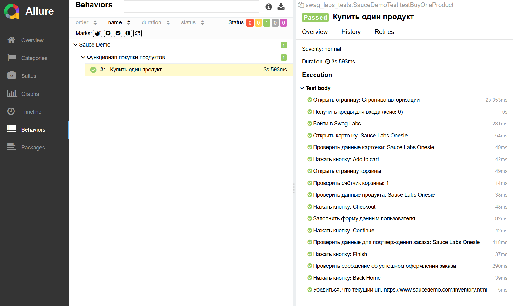

# Демо ui-тестов под 2-х уровневую архитектуру

[](https://www.oracle.com/java/)
[](https://junit.org/junit5/)
[](https://selenide.org/)
[](https://allurereport.org/)

Проект демонстрирует подход разработки ui-тестов:
* Уровни тестирования: UI/E2E
* Техника тест-дизайна: Use Case
* Паттерн проектирования: Page Object
* Реализован E2E-сценарий покупки товара
* Allure отчёт с детальными шагами

## Технологический стек
- **Java 25** — Язык программирования
- **Maven** — Сборщик
- **JUnit 5** — Тест-раннер и фреймворк для написания тестов
- **Selenide** — Библиотека для UI-тестов
- **Allure** — Отчётность
- **JavaFaker** — Генерация тестовых данных

## Запуск тестов
```bash
# Запуск тестов
mvn clean test

# Генерация и открытие Allure отчета
allure serve target/allure-results
```

## Отчёт

